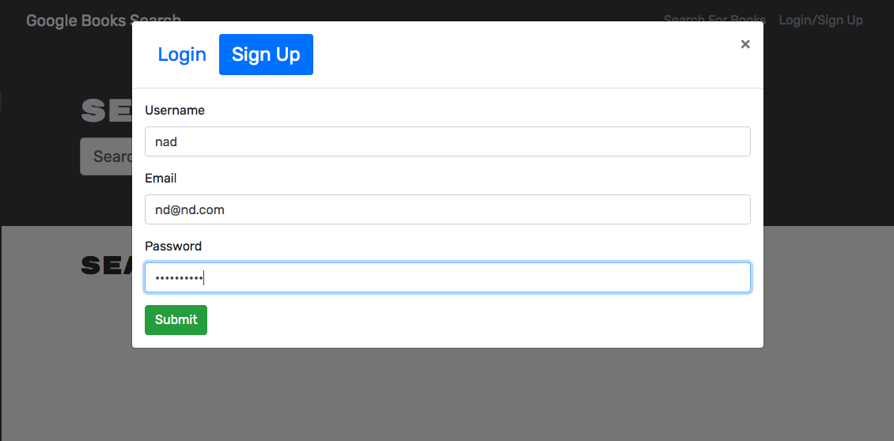
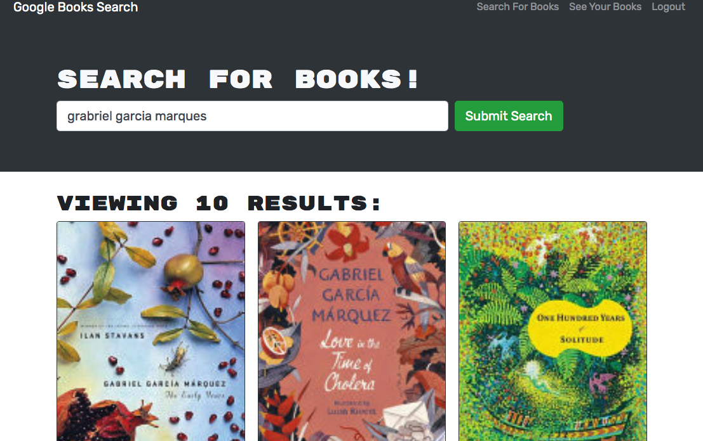
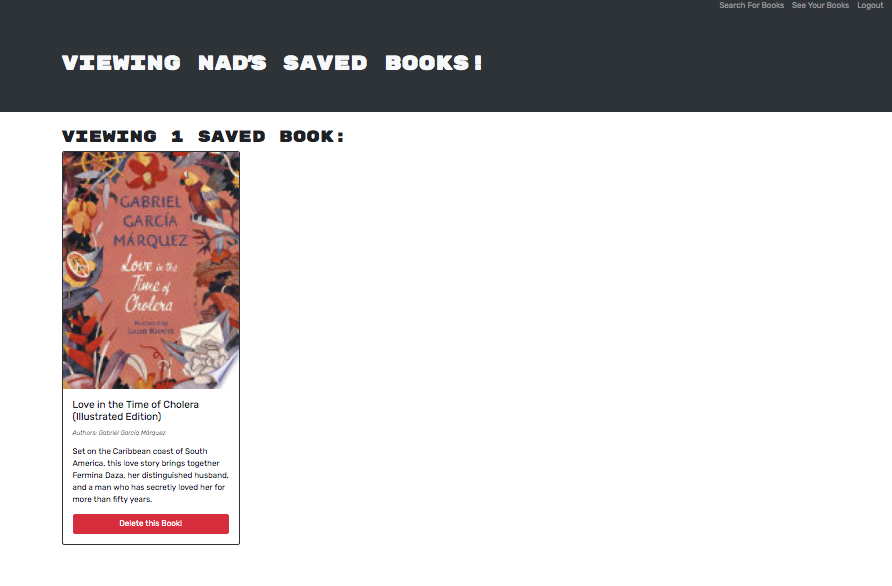

# Search a Book 


## Description 

I took take starter code with a fully functioning Google Books API search engine built with a RESTful API, and refactor it to be a GraphQL API built with Apollo Server. The app was built using the MERN stack with a React front end, MongoDB database, and Node.js/Express.js server and API. 

I did the following changes to the code:

1. I set up an Apollo Server to use GraphQL queries and mutations to fetch and modify data, replacing the existing RESTful API.

2. I modified the existing authentication middleware so that it works in the context of a GraphQL API.

3. I created an Apollo Provider so that requests can communicate with an Apollo Server.

## User Story

```md
AS AN avid reader
I WANT to search for new books to read
SO THAT I can keep a list of books to purchase
```

## Table of Content

- [Installation](#installation)

- [Technology](#technology)

- [Features](#features)

- [Contributions](#contributions)

- [License](#license)

- [Questions](#questions)

## Installation
_Steps require to install this project and to run it in development mode:_

1. After cloning or dowloading thi repo, Run the command below in the terminal:

```bash
npm init
```
2. To generate the application run the following command in the terminal:

```bash
npm run develop
```
3.  To launch the GraphQL Playground, open <localhost:3001/graphql> in the browser.

## Technology

- HTML
- CSS
- JavaScript
- Node.js
- Express.js
- [MongoDB](https://docs.mongodb.com)
- [Mongoose](https://mongoosejs.com/)
- MongoDB Atlas
- React
- Apollo 
- Heroku

## Features

The following is the live link of the application:

[Search many Books](https://search-many-books.herokuapp.com/)

The GitHub repo link: 

[Repo search-a-book](https://github.com/ndorado3/search-a-book)

### Function
1. A user can Sign up & Login: 



2. A user can type a search term (in this case, "gabriel garcia markez") in a search box and the results appear:




3. The user can save books by clicking "Save This Book!" under each search result:


4. A user can view their saved books on a separate page:


5. A user can deleted a book from the "See your books" page by clicking "Delete this Book" under each saved book: 



## Contributions

The following were contributors to this project:

- [Nadia Dorado](https://github.com/ndorado3)
- GT Coding Bootcamp Projects Design Team

## License

MIT

Copyright (c) [2021] [Nadia Dorado]

Permission is hereby granted, free of charge, to any person obtaining a copy of this software and associated documentation files (the "Software"), to deal in the Software without restriction, including without limitation the rights to use, copy, modify, merge, publish, distribute, sublicense, and/or sell copies of the Software, and to permit persons to whom the Software is furnished to do so, subject to the following conditions:

The above copyright notice and this permission notice shall be included in all copies or substantial portions of the Software.

THE SOFTWARE IS PROVIDED "AS IS", WITHOUT WARRANTY OF ANY KIND, EXPRESS OR IMPLIED, INCLUDING BUT NOT LIMITED TO THE WARRANTIES OF MERCHANTABILITY, FITNESS FOR A PARTICULAR PURPOSE AND NONINFRINGEMENT. IN NO EVENT SHALL THE AUTHORS OR COPYRIGHT HOLDERS BE LIABLE FOR ANY CLAIM, DAMAGES OR OTHER LIABILITY, WHETHER IN AN ACTION OF CONTRACT, TORT OR OTHERWISE, ARISING FROM, OUT OF OR IN CONNECTION WITH THE SOFTWARE OR THE USE OR OTHER DEALINGS IN THE SOFTWARE.

## Questions

For questions about this project please contact me:

- Email: nadiadorado@gmail.com
- Github: https://github.com/ndorado3


